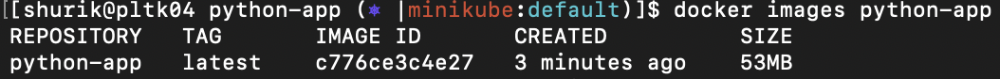
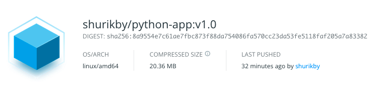
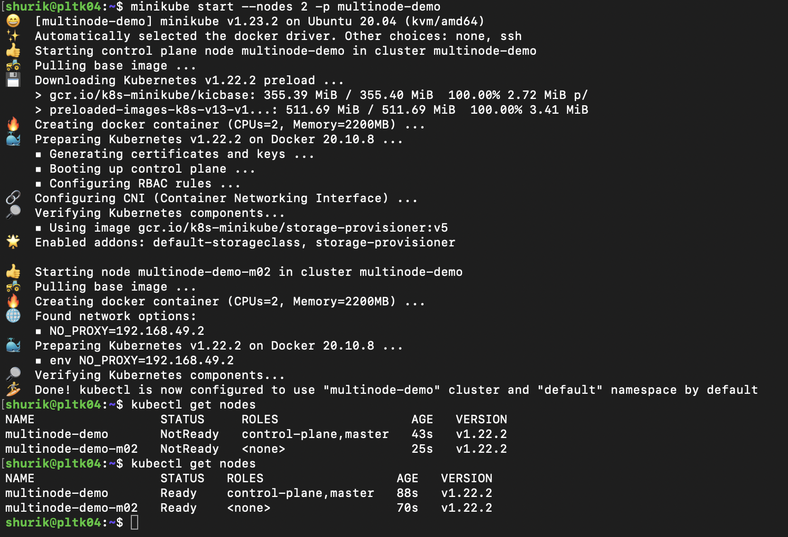
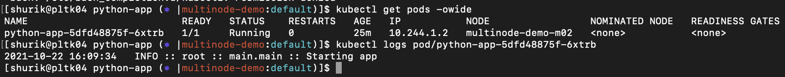

## Build docker image with Python  application - 3

Dockerfile:  

~~~
FROM python:3.7-alpine
RUN adduser --disabled-password python
USER python
COPY --chown=python:python application/ /home/python/application/
WORKDIR /home/python/application
ENV PATH="/home/python/.local/bin:${PATH}"
RUN pip install --user aiohttp multidict==4.5.2 yarl==1.3.0 && python3 setup.py install --user 
CMD python3 -m demo
~~~

.dockerignore:  

~~~
**
!/application/**
~~~

Building docker image:

~~~
[shurik@pltk04 python-app (⎈ |minikube:default)]$ docker build . -t python-app --no-cache
Sending build context to Docker daemon  13.31kB
Step 1/8 : FROM python:3.7-alpine
 ---> 206aee52d71d
Step 2/8 : RUN adduser --disabled-password python
 ---> Running in c523b3590d32
Removing intermediate container c523b3590d32
 ---> 0753025f5230
Step 3/8 : USER python
 ---> Running in 02f0d97cda72
Removing intermediate container 02f0d97cda72
 ---> c320975df236
Step 4/8 : COPY --chown=python:python application/ /home/python/application/
 ---> 745331bb9147
Step 5/8 : WORKDIR /home/python/application
 ---> Running in c3f36da7c0a5
Removing intermediate container c3f36da7c0a5
 ---> b43d7175d832
Step 6/8 : ENV PATH="/home/python/.local/bin:${PATH}"
 ---> Running in ff6637bcd349
Removing intermediate container ff6637bcd349
 ---> ad36bef3c023
Step 7/8 : RUN pip install --user aiohttp multidict==4.5.2 yarl==1.3.0 && python3 setup.py install --user
 ---> Running in cb70849c8b08
Collecting aiohttp
  Downloading aiohttp-3.7.4.post0.tar.gz (1.1 MB)
  Installing build dependencies: started
  Installing build dependencies: finished with status 'done'
  Getting requirements to build wheel: started
  Getting requirements to build wheel: finished with status 'done'
    Preparing wheel metadata: started
    Preparing wheel metadata: finished with status 'done'
Collecting multidict==4.5.2
  Downloading multidict-4.5.2.tar.gz (105 kB)
Collecting yarl==1.3.0
  Downloading yarl-1.3.0.tar.gz (159 kB)
Collecting idna>=2.0
  Downloading idna-3.3-py3-none-any.whl (61 kB)
Collecting typing-extensions>=3.6.5
  Downloading typing_extensions-3.10.0.2-py3-none-any.whl (26 kB)
Collecting attrs>=17.3.0
  Downloading attrs-21.2.0-py2.py3-none-any.whl (53 kB)
Collecting async-timeout<4.0,>=3.0
  Downloading async_timeout-3.0.1-py3-none-any.whl (8.2 kB)
Collecting chardet<5.0,>=2.0
  Downloading chardet-4.0.0-py2.py3-none-any.whl (178 kB)
Building wheels for collected packages: multidict, yarl, aiohttp
  Building wheel for multidict (setup.py): started
  Building wheel for multidict (setup.py): finished with status 'done'
  Created wheel for multidict: filename=multidict-4.5.2-py3-none-any.whl size=90372 sha256=5b5a0247f62152150e2d04526014b9dbf91aceec3684ba25dcd8e61b6a4ebdc7
  Stored in directory: /home/python/.cache/pip/wheels/1f/b2/24/3b59bf2f0e4a78aca765a6708e0d07e1614946fd1eab909e18
  Building wheel for yarl (setup.py): started
  Building wheel for yarl (setup.py): finished with status 'done'
  Created wheel for yarl: filename=yarl-1.3.0-py3-none-any.whl size=84928 sha256=c0230e81db277f08fea436916cd7f633b27023acdb52e12047f11a829d91fa69
  Stored in directory: /home/python/.cache/pip/wheels/4b/c1/ba/a513db30569ac269e885ed411b95b6c28c6f9d1fd54fced96e
  Building wheel for aiohttp (PEP 517): started
  Building wheel for aiohttp (PEP 517): finished with status 'done'
  Created wheel for aiohttp: filename=aiohttp-3.7.4.post0-py3-none-any.whl size=451944 sha256=1b5c82eb9a26090ee1be0e1041d2bf5bdad6a6ec999e5cfeb4a3008c14e4be9f
  Stored in directory: /home/python/.cache/pip/wheels/bd/0d/e4/0c19968442faab6bbde7b6586e00ed7887e6e91be32a8cdc1a
Successfully built multidict yarl aiohttp
Installing collected packages: multidict, idna, yarl, typing-extensions, chardet, attrs, async-timeout, aiohttp
Successfully installed aiohttp-3.7.4.post0 async-timeout-3.0.1 attrs-21.2.0 chardet-4.0.0 idna-3.3 multidict-4.5.2 typing-extensions-3.10.0.2 yarl-1.3.0
running install
running bdist_egg
running egg_info
creating demo.egg-info
writing demo.egg-info/PKG-INFO
writing dependency_links to demo.egg-info/dependency_links.txt
writing entry points to demo.egg-info/entry_points.txt
writing requirements to demo.egg-info/requires.txt
writing top-level names to demo.egg-info/top_level.txt
writing manifest file 'demo.egg-info/SOURCES.txt'
reading manifest file 'demo.egg-info/SOURCES.txt'
writing manifest file 'demo.egg-info/SOURCES.txt'
installing library code to build/bdist.linux-x86_64/egg
running install_lib
running build_py
creating build
creating build/lib
creating build/lib/demo
copying demo/web_app.py -> build/lib/demo
copying demo/main.py -> build/lib/demo
copying demo/__init__.py -> build/lib/demo
copying demo/routes.py -> build/lib/demo
copying demo/__main__.py -> build/lib/demo
copying demo/logger.py -> build/lib/demo
copying demo/views.py -> build/lib/demo
creating build/bdist.linux-x86_64
creating build/bdist.linux-x86_64/egg
creating build/bdist.linux-x86_64/egg/demo
copying build/lib/demo/web_app.py -> build/bdist.linux-x86_64/egg/demo
copying build/lib/demo/main.py -> build/bdist.linux-x86_64/egg/demo
copying build/lib/demo/__init__.py -> build/bdist.linux-x86_64/egg/demo
copying build/lib/demo/routes.py -> build/bdist.linux-x86_64/egg/demo
copying build/lib/demo/__main__.py -> build/bdist.linux-x86_64/egg/demo
copying build/lib/demo/logger.py -> build/bdist.linux-x86_64/egg/demo
copying build/lib/demo/views.py -> build/bdist.linux-x86_64/egg/demo
byte-compiling build/bdist.linux-x86_64/egg/demo/web_app.py to web_app.cpython-37.pyc
byte-compiling build/bdist.linux-x86_64/egg/demo/main.py to main.cpython-37.pyc
byte-compiling build/bdist.linux-x86_64/egg/demo/__init__.py to __init__.cpython-37.pyc
byte-compiling build/bdist.linux-x86_64/egg/demo/routes.py to routes.cpython-37.pyc
byte-compiling build/bdist.linux-x86_64/egg/demo/__main__.py to __main__.cpython-37.pyc
byte-compiling build/bdist.linux-x86_64/egg/demo/logger.py to logger.cpython-37.pyc
byte-compiling build/bdist.linux-x86_64/egg/demo/views.py to views.cpython-37.pyc
creating build/bdist.linux-x86_64/egg/EGG-INFO
copying demo.egg-info/PKG-INFO -> build/bdist.linux-x86_64/egg/EGG-INFO
copying demo.egg-info/SOURCES.txt -> build/bdist.linux-x86_64/egg/EGG-INFO
copying demo.egg-info/dependency_links.txt -> build/bdist.linux-x86_64/egg/EGG-INFO
copying demo.egg-info/entry_points.txt -> build/bdist.linux-x86_64/egg/EGG-INFO
copying demo.egg-info/not-zip-safe -> build/bdist.linux-x86_64/egg/EGG-INFO
copying demo.egg-info/requires.txt -> build/bdist.linux-x86_64/egg/EGG-INFO
copying demo.egg-info/top_level.txt -> build/bdist.linux-x86_64/egg/EGG-INFO
creating dist
creating 'dist/demo-0.2-py3.7.egg' and adding 'build/bdist.linux-x86_64/egg' to it
removing 'build/bdist.linux-x86_64/egg' (and everything under it)
Processing demo-0.2-py3.7.egg
creating /home/python/.local/lib/python3.7/site-packages/demo-0.2-py3.7.egg
Extracting demo-0.2-py3.7.egg to /home/python/.local/lib/python3.7/site-packages
Adding demo 0.2 to easy-install.pth file
Installing demo script to /home/python/.local/bin

Installed /home/python/.local/lib/python3.7/site-packages/demo-0.2-py3.7.egg
Processing dependencies for demo==0.2
Searching for yarl==1.3.0
Best match: yarl 1.3.0
Adding yarl 1.3.0 to easy-install.pth file

Using /home/python/.local/lib/python3.7/site-packages
Searching for multidict==4.5.2
Best match: multidict 4.5.2
Adding multidict 4.5.2 to easy-install.pth file

Using /home/python/.local/lib/python3.7/site-packages
Searching for aiohttp==3.7.4.post0
Best match: aiohttp 3.7.4.post0
Adding aiohttp 3.7.4.post0 to easy-install.pth file

Using /home/python/.local/lib/python3.7/site-packages
Searching for idna==3.3
Best match: idna 3.3
Adding idna 3.3 to easy-install.pth file

Using /home/python/.local/lib/python3.7/site-packages
Searching for attrs==21.2.0
Best match: attrs 21.2.0
Adding attrs 21.2.0 to easy-install.pth file

Using /home/python/.local/lib/python3.7/site-packages
Searching for async-timeout==3.0.1
Best match: async-timeout 3.0.1
Adding async-timeout 3.0.1 to easy-install.pth file

Using /home/python/.local/lib/python3.7/site-packages
Searching for chardet==4.0.0
Best match: chardet 4.0.0
Adding chardet 4.0.0 to easy-install.pth file
Installing chardetect script to /home/python/.local/bin

Using /home/python/.local/lib/python3.7/site-packages
Searching for typing-extensions==3.10.0.2
Best match: typing-extensions 3.10.0.2
Adding typing-extensions 3.10.0.2 to easy-install.pth file

Using /home/python/.local/lib/python3.7/site-packages
Finished processing dependencies for demo==0.2
Removing intermediate container cb70849c8b08
 ---> 01f961cd346c
Step 8/8 : CMD python3 -m demo
 ---> Running in f66a8d7d351e
Removing intermediate container f66a8d7d351e
 ---> c776ce3c4e27
Successfully built c776ce3c4e27
Successfully tagged python-app:latest
~~~
Results:  
Image size 53mb on disk, 20mb compressed at docker hub  

## Setup K8S cluster using Minikube(1 master + 1 worker node is enough): - 1

Installing kubectl & minikube
~~~
shurik@pltk04:~$ curl -LO https://storage.googleapis.com/kubernetes-release/release/`curl -s https://storage.googleapis.com/kubernetes-release/release/stable.txt`/bin/linux/amd64/kubectl
  % Total    % Received % Xferd  Average Speed   Time    Time     Time  Current
                                 Dload  Upload   Total   Spent    Left  Speed
100 44.7M  100 44.7M    0     0  6398k      0  0:00:07  0:00:07 --:--:-- 5888k
shurik@pltk04:~$ chmod +x ./kubectl
shurik@pltk04:~$ sudo mv ./kubectl /usr/local/bin/kubectl
[sudo] password for shurik: 
shurik@pltk04:~$ kubectl version --client
Client Version: version.Info{Major:"1", Minor:"22", GitVersion:"v1.22.2", GitCommit:"8b5a19147530eaac9476b0ab82980b4088bbc1b2", GitTreeState:"clean", BuildDate:"2021-09-15T21:38:50Z", GoVersion:"go1.16.8", Compiler:"gc", Platform:"linux/amd64"}
shurik@pltk04:~$ curl -Lo minikube https://storage.googleapis.com/minikube/releases/latest/minikube-linux-amd64 \
>   && chmod +x minikube
  % Total    % Received % Xferd  Average Speed   Time    Time     Time  Current
                                 Dload  Upload   Total   Spent    Left  Speed
100 65.8M  100 65.8M    0     0  6209k      0  0:00:10  0:00:10 --:--:-- 5909k
shurik@pltk04:~$ sudo mkdir -p /usr/local/bin/
shurik@pltk04:~$ sudo install minikube /usr/local/bin/
shurik@pltk04:~$ minikube version
minikube version: v1.23.2
commit: 0a0ad764652082477c00d51d2475284b5d39ceed
~~~

## Deploy the application into the K8S cluster - 3

Creating basic Deployment.yaml:  

~~~
kubectl create deployment python-app --image shurikby/python-app:v1.0 --dry-run=client -oyaml >Deployment.yaml
~~~

Deployment.yaml at this moment:  

~~~
apiVersion: apps/v1
kind: Deployment
metadata:
  creationTimestamp: null
  labels:
    app: python-app
  name: python-app
spec:
  replicas: 1
  selector:
    matchLabels:
      app: python-app
  strategy: {}
  template:
    metadata:
      creationTimestamp: null
      labels:
        app: python-app
    spec:
      containers:
      - image: shurikby/python-app:v1.0
        name: python-app
        resources: {}
status: {}
~~~

Deploying:  

~~~
[shurik@pltk04 python-app (⎈ |multinode-demo:default)]$ kubectl apply -f Deployment.yaml
deployment.apps/python-app created
~~~

Result:  

## * The deployment requires 3 replicas, “RollingUpdate” strategy. Emulate the “RollingUpdate” strategy by updating docker image. Provide screenshots. Define the liveness and readiness probes to /health endpoint and 8080 port, resources(requests/limits)

## * Create a “Service” object which exposes Pods with application outside the K8S cluster in order to access each of the replicas through the single IP address/DNS name.

## * Specify PodDistruptionBudget which defines that only 1 replica can be down.